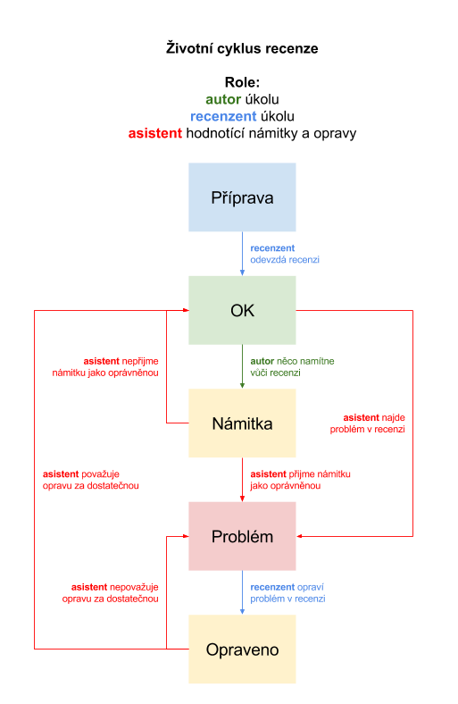

# Hodnocení úkolů

Hodnocení vypracovaných úkolů (recenze) jsou součástí vzdělávacího procesu. Proti recenzím je možné podat námitku — pokud je uznána (vyučujícím nebo asistentem), recenzent musí recenzi přepracovat (doplnit argumentaci, citovat zdroje, upravit skóre apod.). Zpochybněné recenze nejsou zahrnuty do celkového hodnocení.

Recenze může projít několika fázemi:

- *Příprava*: recenze ještě není hotová a odeslaná
- *OK*: hodnocení je v pořádku (pouze tyto recenze se započítávají do celkového hodnocení)
- *Námitka*: v recenzi je nějaký nedostatek a student, který zpracoval úkol, podal námitku
- *Problém*: asistent či vyučující našel problém (sám nebo díky námitce)
- *Opraveno*: recenzent opravil hodnocení (oprava musí být schválena vyučujícím nebo asistentem)

Námitky a odmítnutí (námitky či opravené recenze) musejí obsahovat jasné zdůvodnění sepsané v komentáři.

## Rubriky hodnocení

Každá recenze se skládá z několika komentářů a hodnotících rubrik. 

- V komentářích se recenzent *vyjadřuje* ke konkrétním aspektům úkolu, popř. na něj reaguje či jej rozvíjí. Komentáře slouží jednak k hlubší reflexi zpracovaného úkolu, ale poskytují též příležitost k pohledu na vzdělávací obsah.
	- Příklady komentářů: 
		- „Pokud jste měl/a zadaný jiný text, pečlivě srovnejte závěry autora úkolu a vaše závěry.“
		- „Je shrnutí a postoj autora srozumitelné a argumentačně přesvědčivé? (Pokud si nemyslíte, že to dokážete zhodnotit, přečtěte si nějaký doplňkový text.)“
- Rubriky slouží k *hodnocení* konkrétních aspektů úkolu a obsahují předdefinované stupně hodnocení, které by měly být objektivně měřitelné. (Strukturu recenze je možné postavit bez specifických rubrik: pak je využita „obecná“ rubrika, což však snižuje porovnatelnost jednotlivých hodnocení.)
	- Příklad rubriky a stupňů hodnocení: *„Je shrnutí v prvním úkolu srozumitelné?“*
    	- Shrnutí je nesrozumitelné nebo chybí.
    	- "Text korektně pracuje s kategoriemi *webových služeb*, *CMS* a *generátorů statických stránek*."
    	- "Popis rozdílů mezi zmiňovanými kategoriemi nástrojů je srozumitelný."
    	- "Vysvětlení pracuje s dalšími dohledanými zdroji, které jsou v úkolu zmíněny."
 
Z číselných hodnocení je vytvořen geometrický průměr, který je obdobou aritmetického průměru, jen místo sčítání využívá násobení. To má jeden zásadní důsledek: pokud se mezi hodnoceními objeví nula, celý úkol je hodnocen nulou. Tím je kladen důraz na zpracování kompletních úkolů (aby nedocházelo např. k tomu, že studenti zpracují teoretickou část a vynechají praktickou – úkol se pak zdá být „napůl zpracovaný“, ale z hlediska získaných dovedností je nedostatečný).

## Životní cyklus 

Recenze může projít následující cestou:

- **Příprava** — recenzent píše recenzi
	- recenzent dokončí recenzi a odevzdá ji **(→&nbsp;OK)**
- **OK** — recenze je v pořádku
	- recenzze je *skutečně v pořádku* a nic se už nikdy nestane **(jupí!)**  
	**nebo**
	- recenze je *špatná* a
		- autor úkolu vznese námitku **(→&nbsp;námitka)**
		- asistent najde recenzi a označí ji jako problematickou **(→&nbsp;problém)**
- **Námitka** — byla vznesena námitka vůči hodnocení
	- asistent prozkoumá recenzi a námitku vyhodnotí jako
		- *oprávněnou* a označí recenzi jako problematickou **(→&nbsp;problém)**  
		- *neoprávněnou* a vrátí recenzi status OK **(→&nbsp;OK)**
- **Problém** — v recenzi je identifikovaný problém
	- recenzent opraví hodnocení a předá opravu k vyhodnocení **(→&nbsp;opraveno)**
- **Opraveno** — k dispozici je oprava a čeká se na vyhodnocení
	- asistent prozkoumá opravu a vyhodnotí ji jako
		- *nedostatečnou* a označí recenzi zase coby problematickou **(→&nbsp;problém)**
		- *dostatečnou* a vrátí recenzi status OK **(→&nbsp;OK)**
	

	 
	<caption><i>životní cyklus recenze</i></caption>

