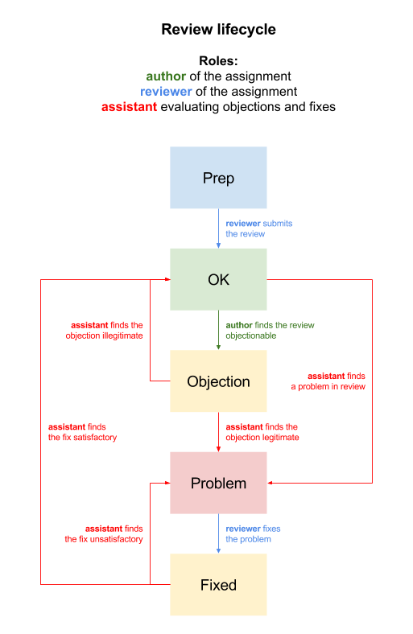

# Assessment

Homework's assessment (a review) is a part of the learning process. Reviews are objectionable — if the raised objections are found valid (by teacher or assistants), reviewer needs to correct their review (add arguments, cite sources, correct the score etc.). Questioned reviews are not included in course scoring.

A review may enter several states:

- *prep*: the review is not completed and submitted yet
- *OK*: a valid review (in the course stats, only valid reviews are counted)
- *objection*: the review has some flaw and the reviewed raised an objection
- *problem*: an assistant found a problem (via objection or even on their own)
- *fixed*: reviewer fixed the review (the fix needs to be approved by teacher or assistant)

There needs to be a *clear justification* in every objection and rejection (of an objection or a fix) written in the comment.

## Assessment rubrics

Every assessment consists of several comments and rubrics.

- The reviewer provides an informed commentary through comments. The instructions may contain even a request for a further look into the topic or some kind of interaction (answering questions from the student being assessed etc.). This should provide an opportunity for a reflection of the assessed assignment's and of the topic itself at the same time.
	- Comment examples:
		- “If you had another article in your own assignment, compare your conclusions to the ones above.”
		- “Is the summary articulate and the conclusions convincing?”
- The rubrics are used to score specific aspects of the assignment's solution. Every rubric is comprised of several levels that should be objectively „measurable“: the reviewer should be able to clearly decide which level has been achieved by the author of the assessed assignment. (It's possible to build a review structure without a specific rubric: then a „default rubric“ is used, however reducing the comparability and fairness of scoring.)
	- Example of a rubric and scoring scale: *„Is the summary and explanation well written?“*
		- The summary is missing or inarticulate.
		- The author uses the important categories (web services, CMS, static web generators) correctly.
		- The description of differences between important categories is right.
		- The explanation uses further sources on the subject and they are cited or mentioned.

The overall score is calculated as a geometric mean. It's similar to arithmetic mean, using the multiplication instead of addition. This has one principal consequence: if one rubric is scored with zero point, the review itself is rated zero points. This stresses the importance of assignment's completion. (Otherwise a student who fails to touch the practical part of the assignment could be rated high for their theoretical learning success: nevertheless failing to reach the educational goals.)

## Review lifecycle

The possible lifecycle is as follows:

- **prep** — a review is being written
	- the reviewer finishes a review and submits it **(→&nbsp;OK)**
- **OK** — the review is valid
	- the review is *really OK* and nothing ever happens **(yeah!)**  
	**or**
	- the review is *bad* and
		- the author of the assignment raises an objection **(→&nbsp;objection)**
		- an assistant finds the review and marks it as problematic **(→&nbsp;problem)**
- **objection** — an *objection* has been raised against the review
	- an assistant examines the review and finds the objection 
	    - *legitimate* and marks the review as problematic **(→&nbsp;problem)**
	    - *illegitimate* and marks the review as OK **(→&nbsp;OK)**
- **problem** — there is an identified flaw in the review
	- the reviewer fixes the review and submits it for evaluation **(→&nbsp;fixed)**
- **fixed** — there is a fix submitted by the reviewer to be evaluated
    - an assistant examines the fix and finds it
	    - *unsatisfactory* and marks the review back as problematic **(→&nbsp;problem)**
	    - *satisfactory* and marks the review as OK **(→&nbsp;OK)**
	

	 
	<caption><i>review lifecycle</i></caption>

