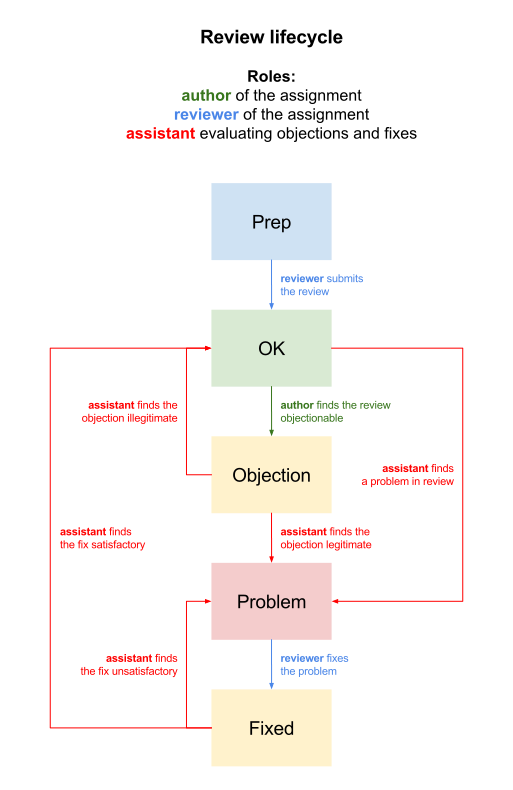

# Lifecycle of a review

Homework's assessment (a review) is a part of the learning process. Reviews are objectionable — if the raised objections are found valid (by teacher or assistants), reviewer needs to correct their review (add arguments, cite sources, correct the score etc.).

A review may enter several states:

- *prep*: the review is not completed and submitted yet
- *OK*: a valid review (in the course stats, only valid reviews are counted)
- *objection*: the review has some flaw and the reviewed raised an objection
- *problem*: an assistant found a problem (via objection or even on their own)
- *fixed*: reviewer fixed the review (the fix needs to be approved by teacher or assistant)

There needs to be a *clear justification* in every objection and rejection (of an objection or a fix) written in the comment.

The possible lifecycle is as follows:

- **prep** — a review is being written
	- the reviewer finishes a review and submits it **(→&nbsp;OK)**
- **OK** — the review is valid
	- the review is *really OK* and nothing ever happens **(yeah!)**  
	**or**
	- the review is *bad* and
		- the author of the assignment raises an objection **(→&nbsp;objection)**
		- an assistant finds the review and marks it as problematic **(→&nbsp;problem)**
- **objection** — an *objection* has been raised against the review
	- an assistant examines the review and finds the objection 
	    - *legitimate* and marks the review as problematic **(→&nbsp;problem)**
	    - *illegitimate* and marks the review as OK **(→&nbsp;OK)**
- **problem** — there is an identified flaw in the review
	- the reviewer fixes the review and submits it for evaluation **(→&nbsp;fixed)**
- **fixed** there is a fix submitted by the reviewer to be evaluated
    - an assistant examines the fix and finds it
	    - *unsatisfactory* and marks the review back as problematic **(→&nbsp;problem)**
	    - *satisfactory* and marks the review as OK **(→&nbsp;OK)**
	

	
	<caption><i>review lifecycle ([PNG version](illustrations/review-lifecycle.png))</i></caption>

